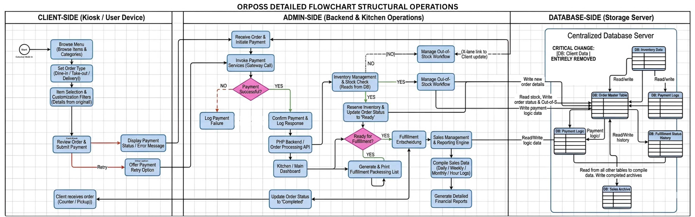

# ORPOSS SYSTEMS OPERATIONAL DETAILED ANALYSIS

**Developed by BSIT 1-5 BATCH #1**

A comprehensive, desktop-based Point of Sale (POS) system architecture designed for high-volume food service. This project focuses on high-speed transactional logic, real-time inventory synchronization, and total customer anonymity.

## 🚀 System Architecture

* **Anonymous Flow:** Zero collection of PII (Name/Phone) for rapid checkout.
* **KDS Integration:** Real-time Kitchen Display System for order fulfillment.
* **Live Inventory:** Automated stock deductions and out-of-stock triggers.
* **Modular Backend:** PHP-based API routing between the UI and centralized Database.
* **Financial Auditing:** Secure sales archiving and daily revenue tracking.

## 🛠️ Operational Workflow

1. **Client-Side:** User browses the dynamic menu, selects customizations, and processes payment via a secure gateway.
2. **Admin-Side:** The system validates the transaction and pushes the order to the kitchen prep screen (KDS).
3. **Database-Side:** The transaction is logged, ingredients are deducted from inventory, and sales data is archived for reporting.

---

### 📂 File Reference
ORPOSS DETAILED OPERATIONAL FLOWCHART:

